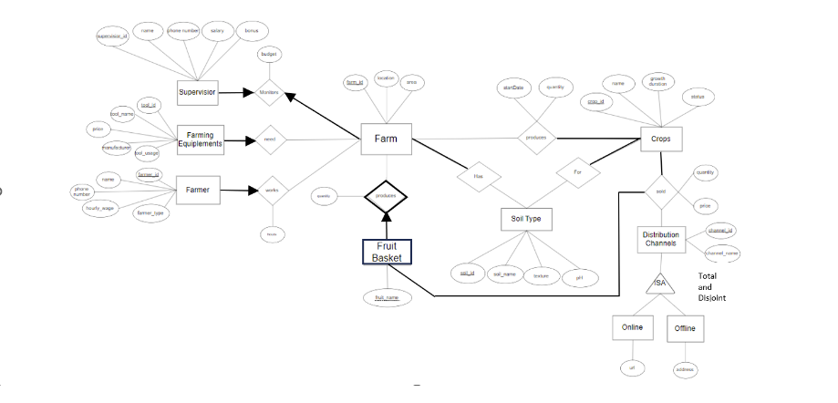

# CPSC 304 - Project
#### Summary 
The project is based on the database management of an agricultural firm. The model can be
used by agricultural companies for to streamline farm operations, crop production and crop
distribution.
### Entities
1. Farms - Farms are owned in different locations by the agricultural firm.
2. Farmers - Farmers are assigned to work at specific farms by the agricultural
firm. 
3. Supervisors - Supervisors are hired by the firm to monitor the proper functioning
of the farms along with forming a budget of each farm.
4. Crops - Crops are produced by farms and the company keeps track of the
quantity and type of crops produced. These crops are later sold through
distribution channels.
5. Soil Type - The company keeps track of the specific soil types needed for each
crop and the soil type of each farm. This ensures that the crops are cultivated in a
proper environment.
6. Farming Equipment – Farms need different equipment for farming purposes.
7. Distribution Channels - The crops produced are sold through different
distribution channels such as offline and online
### ER Diagram

#### Application
The application models the farming management aspects of the agricultural firm. In real life, this model can be used by a firm which owns multiple farms, assigns multiple farmers work on these farms, produces different varieties of crops and sells the produced crops through different channels. Such an agricultural firm will
need to keep track of the location, soil type and area of each owned farm, type and quantity of each crop produced by each farm and the contact and personal
details of the farmers working on the farms, details of the supervisors monitoring the farms. The company will also need to keep track of the budget needed for
each farm and the farming tools needed by each farm. The management of such companies will require an application model to keep a record of all the operations which is addressed by this application model.
